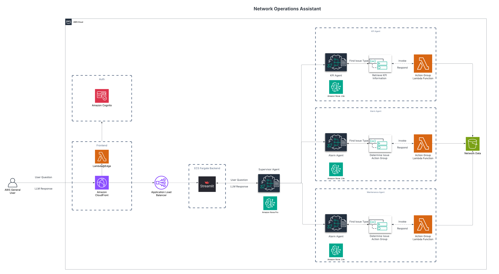

# Network Operations Assistant

A comprehensive solution for network operations monitoring and management using Amazon Bedrock Agents and Streamlit.

## Solution Overview

The Network Operations Assistant is an intelligent chat interface that helps network operations teams monitor and manage their network infrastructure. It leverages Amazon Bedrock's multi-agent architecture to provide a unified interface for querying network status, maintenance schedules, alarms, and performance metrics.

### Key Features

- **Intelligent Multi-Agent Architecture**: Uses a supervisor agent that coordinates with specialized sub-agents
- **Real-time Network Monitoring**: Query active alarms and performance metrics
- **Maintenance Schedule Management**: Check ongoing and upcoming maintenance activities
- **Performance Analysis**: Analyze KPIs and identify anomalies
- **User-friendly Interface**: Intuitive chat interface built with Streamlit

### Architecture Diagram



## Technical Components

1. **Amazon Bedrock Agents**:
   - **Supervisor Agent**: Orchestrates interactions between sub-agents and provides a unified interface
   - **Maintenance Agent**: Specializes in retrieving and analyzing maintenance schedules
   - **Alarm Agent**: Monitors and analyzes network alarms with severity-based recommendations
   - **KPI Agent**: Analyzes performance metrics and identifies anomalies

2. **AWS Lambda Functions**:
   - **Maintenance Checker**: Retrieves and processes maintenance schedule data
   - **Alarm Checker**: Retrieves and analyzes active alarms
   - **KPI Analyzer**: Processes performance metrics and identifies trends
   - **Initial Data Load**: Generates synthetic network data for demonstration

3. **Containerized Streamlit Application**:
   - Deployed on AWS Fargate for scalability
   - Accessible via CloudFront for global availability and HTTPS
   - Automatic credential refresh mechanism for uninterrupted operation

4. **Data Storage**:
   - S3 bucket with CSV files for network sites, maintenance schedules, alarms, and KPIs
   - Easily updatable for integration with real network data sources

## Deployment Guide

### Prerequisites

1. **AWS CLI v2**
   - Download from: https://aws.amazon.com/cli/
   - Verify installation: `aws --version`

2. **AWS SAM CLI**
   - Download from: https://docs.aws.amazon.com/serverless-application-model/latest/developerguide/install-sam-cli.html
   - Verify installation: `sam --version`

3. **Docker Desktop**
   - Download from: https://www.docker.com/products/docker-desktop/
   - Ensure Docker is running before deployment
   - Verify installation: `docker --version`

4. **Python 3.9+**
   - Download from: https://www.python.org/downloads/
   - Ensure pip is installed
   - Verify installation: `python --version`

5. **PowerShell 5.1+ or PowerShell Core 7+** (Windows only)
   - Windows 10/11 comes with PowerShell 5.1
   - For PowerShell Core: https://github.com/PowerShell/PowerShell

#### AWS Configuration

Configure your AWS credentials:

```bash
aws configure
```

Or set up a named profile:

```bash
aws configure --profile your-profile-name
```

**Important**: Enable access to Amazon Nova family of models in the specific region where you're deploying the solution. You can manage model access [here](https://us-east-1.console.aws.amazon.com/bedrock/home?region=us-east-1#/modelaccess).

### Step-by-Step Deployment

1. **Clone the Repository**

```bash
git clone https://github.com/aws-samples/sample-multi-agent-collaboration-using-bedrock-for-telco-network-ops.git
cd sample-multi-agent-collaboration-using-bedrock-for-telco-network-ops
```

2. **Deploy the Solution**

The deployment script handles the entire process, including creating Lambda functions, S3 buckets, Bedrock agents, and deploying the Streamlit application:

**For Linux/macOS:**
```bash
./build_and_deploy.sh [stack-name] [region] [profile]
```

**For Windows PowerShell:**
```powershell
.\build_and_deploy.ps1 -StackName [stack-name] -Region [region] -Profile [profile]
```

Parameters:
- `stack-name`: Name for your CloudFormation stack (default: netops) - Note: Do not include hyphens (-) in the stack name
- `region`: AWS region to deploy to (default: us-east-1)
- `profile`: AWS CLI profile to use (default: default)

The deployment process:
1. Creates a Lambda layer with pandas and numpy dependencies
2. Deploys Lambda functions for agent tools
3. Creates an S3 bucket and loads it with synthetic network data
4. Creates and configures Bedrock agents with appropriate permissions
5. Builds and deploys the Streamlit application as a container in Fargate
6. Sets up CloudFront distribution for secure access

3. **Access the Application**

After deployment completes (approximately 15-20 minutes), you'll receive a CloudFront URL. Open this URL in your browser to access the Network Operations Assistant.

```
Deployment complete!
Streamlit application will be available at: https://d123456abcdef.cloudfront.net
```

### Updating the Container

If you need to update just the Streamlit application container without redeploying the entire stack:

**For Linux/macOS:**
```bash
./update-container.sh [stack-name] [region] [profile]
```

**For Windows PowerShell:**
```powershell
.\update-container.ps1 -StackName [stack-name] -Region [region] -Profile [profile]
```

This will rebuild and redeploy only the container, which is much faster than a full deployment.

## Using the Network Operations Assistant

### Getting Started

1. Open the CloudFront URL provided at the end of deployment
2. You'll see a chat interface with a welcome message
3. Type your network operations query in natural language
4. The assistant will process your query and provide a response

### Example Queries

Try these example queries to explore the capabilities:

#### Basic Site Information
- "What's the status of site_dallas_001?"
- "Give me an overview of site_birmingham_003"
- "Show me all sites in Atlanta"

#### Maintenance Queries
- "Is there any ongoing maintenance at site_dallas_002?"
- "Show me upcoming maintenance for site_birmingham_004"
- "When is the next scheduled maintenance for site_atlanta_003?"

#### Alarm Monitoring
- "Are there any critical alarms active right now?"
- "Show me all alarms for site_dallas_001"
- "What's the status of the SITE_DOWN alarm on site_birmingham_002?"

#### Performance Analysis
- "How is site_ridgeland_005 performing?"
- "Show me the throughput metrics for site_dallas_003"
- "Are there any anomalies in the network performance today?"
- "Compare the latency between site_birmingham_001 and site_birmingham_002"

#### Complex Queries
- "Give me a full report on site_dallas_001 including maintenance, alarms, and performance"
- "Which sites have both active alarms and scheduled maintenance?"
- "What's the impact of the current maintenance on site_atlanta_003's performance?"

### Understanding the Response

The assistant's responses include:
- Direct answers to your questions
- Relevant data from maintenance schedules, alarms, or KPIs
- Analysis and recommendations based on the data
- Token usage information for tracking purposes

## Data Management

### Synthetic Data Structure

The solution comes pre-loaded with synthetic data for demonstration:

1. **Sites Data**: Information about network sites including location, type, and commissioning date
2. **Maintenance Schedule**: Planned and ongoing maintenance activities
3. **Alarms**: Active and cleared alarms with severity levels
4. **KPI Metrics**: Performance metrics including throughput, latency, packet loss, etc.

### Updating Data

To use your own network data:

1. Prepare CSV files with the same structure as the synthetic data
2. Upload them to the S3 bucket created during deployment:
   ```bash
   aws s3 cp your-data.csv s3://netops-network-data-{account-id}/data/ --profile your-profile
   ```

## Troubleshooting

### Common Issues and Solutions

1. **Token Expiration Errors**
   - The application automatically refreshes AWS credentials every 15 minutes
   - If you still see token expiration errors, try updating the container with `./update-container.sh`

2. **Agent Invocation Failures**
   - Check CloudWatch logs for detailed error messages
   - Verify IAM permissions for the ECS task role
   - Ensure Bedrock agents were created successfully

3. **Missing Response Data**
   - Check S3 bucket for proper data files
   - Verify Lambda functions can access the S3 bucket
   - Check CloudWatch logs for Lambda function errors

### Accessing Logs

- **Streamlit Application Logs**: CloudWatch Logs group `/ecs/netops`
- **Lambda Function Logs**: CloudWatch Logs groups for each function
- **Bedrock Agent Logs**: CloudWatch Logs for agent invocations

## Cleanup

When you're done with the solution, clean up all resources:

**For Linux/macOS:**
```bash
./cleanup.sh [stack-name] [region] [profile]
```

**For Windows PowerShell:**
```powershell
.\cleanup.ps1 -StackName [stack-name] -Region [region] -Profile [profile]
```

This script:
- Empties the S3 bucket (required for successful deletion)
- Removes ECR images
- Deletes Bedrock agents
- Deletes the CloudFormation stack

## Security Considerations

This solution implements several security best practices:

- **Least Privilege Permissions**: IAM roles with minimal required permissions
- **Secure Communication**: HTTPS via CloudFront
- **Credential Management**: Automatic credential refresh
- **Container Security**: Minimal base image with only required dependencies

## Customization Options

- **Add New Data Sources**: Modify Lambda functions to connect to your network monitoring systems
- **Extend Agent Capabilities**: Update agent instructions and add new action groups
- **Customize UI**: Modify the Streamlit application code
- **Add Authentication**: Implement authentication using Cognito or other identity providers

## License

This project is licensed under the MIT License - see the LICENSE file for details.
## Authentication

The solution includes authentication using Amazon Cognito. When you access the application through CloudFront, you'll be redirected to a Cognito login page. After successful authentication, you'll be redirected back to the application.

### Authentication Flow

1. User accesses the CloudFront URL
2. Lambda@Edge function checks for authentication
3. If not authenticated, redirects to Cognito login
4. After successful login, Cognito redirects back to the application
5. Lambda@Edge function exchanges the authorization code for tokens
6. Tokens are stored as cookies for subsequent requests

### Authentication Components

- **Cognito User Pool**: Manages user identities and authentication
- **Cognito App Client**: Configured for OAuth 2.0 authorization code flow
- **Lambda@Edge Function**: Handles authentication and token exchange
- **CloudFront Distribution**: Serves the application and triggers the Lambda@Edge function

### Troubleshooting Authentication

If you encounter authentication issues:

1. Check the CloudWatch logs for the Lambda@Edge function
2. Verify the Cognito App Client configuration
3. Clear browser cookies and try again
4. Ensure the Lambda@Edge function is properly associated with CloudFront
